# Architecture

How `masonry-angular` works internally: the module graph, the anatomy of a layout pass, the
invalidation model, and the invariants that keep the hot path allocation-free.

This document is about the _implementation_ — why it is shaped the way it is. For the public API and
options, see [the library README](projects/masonry-angular/README.md); for workspace commands, see
[the root README](README.md); and for how to set the repository up and make a change in it, see
[CONTRIBUTING.md](CONTRIBUTING.md), which covers the same machinery as instructions rather than as
reasoning.

---

## Table of contents

- [The one-sentence version](#the-one-sentence-version)
- [Module graph](#module-graph)
- [The collaborators](#the-collaborators)
- [Invalidation: everything funnels into one frame](#invalidation-everything-funnels-into-one-frame)
- [Anatomy of a layout pass](#anatomy-of-a-layout-pass)
- [Bootstrap: why the first layout takes two passes](#bootstrap-why-the-first-layout-takes-two-passes)
- [Column geometry resolution](#column-geometry-resolution)
- [The solver](#the-solver)
- [The signature: skipping work that would change nothing](#the-signature-skipping-work-that-would-change-nothing)
- [Item lifecycle](#item-lifecycle)
- [Motion model](#motion-model)
- [Options pipeline](#options-pipeline)
- [Change detection and zones](#change-detection-and-zones)
- [Server-side rendering and the fallback handoff](#server-side-rendering-and-the-fallback-handoff)
- [Native layout: handing the grid to the browser](#native-layout-handing-the-grid-to-the-browser)
- [Performance invariants](#performance-invariants)
- [Testing model](#testing-model)
- [Extension points](#extension-points)
- [Design decisions and their trade-offs](#design-decisions-and-their-trade-offs)

---

## The one-sentence version

Every source of invalidation is coalesced into a single per-frame pass; that pass performs all DOM
reads, hands measured boxes to a pure solver that knows nothing about Angular or the DOM, and then
performs all DOM writes — never interleaving the two, and skipping the whole middle when a hash of
the inputs says the result cannot have changed.

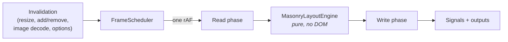

---

## Module graph

Dependencies point downward only. Nothing in `core/` imports the component, and the solver imports
nothing at all.

```mermaid
flowchart TD
    MG["masonry-grid.ts<br/><small>&lt;masonry-grid&gt; — wiring only</small>"]
    ITEM["directives/masonry-grid-item.ts"]
    STAMP["directives/masonry-grid-stamp.ts"]
    SIZER["directives/masonry-grid-sizer.ts"]
    HOST["core/host.ts<br/><small>MasonryGridHost (abstract)</small>"]

    REG["core/item-registry.ts<br/><small>ItemRegistry</small>"]
    SIZES["core/size-watcher.ts<br/><small>SizeWatcher</small>"]
    STYLES["core/item-styles.ts<br/><small>ItemStyles</small>"]
    MOTION["core/motion.ts<br/><small>Motion</small>"]
    SCHED["core/scheduler.ts<br/><small>FrameScheduler</small>"]
    OPTS["core/grid-options.ts<br/><small>GridOptionsResolver</small>"]

    ENGINE["core/layout-engine.ts<br/><small>pure solver</small>"]
    RESOLVER["core/column-resolver.ts<br/><small>width → geometry</small>"]
    SIG["core/layout-signature.ts<br/><small>layoutSignature()</small>"]
    NATIVE["core/native.ts<br/><small>feature detection + CSS tracks</small>"]
    NGRID["core/native-grid.ts<br/><small>native column count</small>"]

    DEF["schemas/defaults.ts<br/><small>frozen option defaults</small>"]
    PARSE["schemas/parse.ts<br/><small>merge / validate / resolve</small>"]
    PROV["providers.ts<br/><small>provideNgMasonryGrid()</small>"]
    MODELS["models/<br/><small>every data shape — types only</small>"]

    MG --> HOST & REG & SIZES & STYLES & MOTION & SCHED & OPTS
    MG --> ENGINE & RESOLVER & SIG & NATIVE & NGRID & PROV
    ITEM --> HOST
    STAMP --> HOST
    SIZER --> HOST
    OPTS --> PARSE
    NGRID --> RESOLVER & NATIVE
    PARSE --> DEF
    DEF -.-> MODELS
    MG & ITEM & HOST & REG & SIZES & STYLES & MOTION & OPTS & ENGINE & RESOLVER & SIG & NATIVE & NGRID & PARSE -.->|type-only| MODELS
    PROV --> PARSE
    MG -.->|provides itself as| HOST

    style ENGINE fill:#0b7285,color:#fff
    style HOST fill:#5f3dc4,color:#fff
    style MODELS fill:#495057,color:#fff
```

Dotted edges are **type-only**. Everything in `models/` is a declaration — no classes, no
constants — so those imports are erased at compile time and the folder contributes nothing to the
bundle. Runtime values stay next to the behaviour that owns them: the solver in `core/`, the
defaults in `schemas/defaults.ts`, the DI token in `core/host.ts`.

The fan-out from `masonry-grid.ts` looks alarming and is the point: the component imports a lot
because it does very little. It constructs the collaborators, hands them to Angular, and sequences
them in `runLayout()`. None of them imports it back. Where a collaborator needs something from the
grid it declares a minimal contract of its own — `SizeWatcherHost` in `core/size-watcher.ts` is
three methods, and `Motion` takes a single `onExitSettled` callback — so each file can be read, and
tested, without Angular anywhere in scope.

Three edges carry most of the design weight:

**`MasonryGrid` provides itself as `MasonryGridHost`.** The directives inject the abstract class,
never the component:

```ts
providers: [{ provide: MasonryGridHost, useExisting: forwardRef(() => MasonryGrid) }],
```

So `masonry-grid-item.ts` has no import edge back to `masonry-grid.ts`. There is no circular
import, the directives are independently testable against a mock host, and the contract in
[`core/host.ts`](projects/masonry-angular/src/lib/core/host.ts) is a single readable file
describing everything a child needs from its grid.

**The solver has no dependencies.** `MasonryLayoutEngine` takes numbers in and returns numbers out.
It is exported from the public API on its own, so it runs in a worker, a Node test, or another
framework's renderer.

---

## The collaborators

`MasonryGrid` is the only Angular-aware object in the library, and the only one that knows a pass
exists. Everything a pass actually *does* belongs to one of the objects below, each of which owns a
single kind of state and is deliberately ignorant of the rest.

| Piece                 | File                    | Owns                                                                         | Deliberately does not know                                                                       |
| --------------------- | ----------------------- | ---------------------------------------------------------------------------- | ------------------------------------------------------------------------------------------------ |
| `MasonryGrid`         | `masonry-grid.ts`       | The inputs, the outputs, the signals, the pass number, and the pass ordering  | How anything below is implemented — it sequences, it does not compute                             |
| `ItemRegistry`        | `core/item-registry.ts` | Which items, stamps and sizer exist; their records; the per-pass buffers      | Options, geometry, styles. It reports membership and order, never what to do about them           |
| `SizeWatcher`         | `core/size-watcher.ts`  | The one `ResizeObserver`, the viewport listener, and three measured widths    | Which element is an item versus a stamp — anything that is not the width source or the sizer is an item |
| `ItemStyles`          | `core/item-styles.ts`   | Every inline style the grid writes onto an item, and the `last*` write guards | Order, measurement, and the solver. It is handed a record and a number                            |
| `Motion`              | `core/motion.ts`        | Entry effects, the deferred transition frame, and the live exit clones        | Layout. It never moves an item; it decorates moves the pass already made                          |
| `FrameScheduler`      | `core/scheduler.ts`     | One pending frame and one pending debounce timer                              | What the callback does, or why it was scheduled                                                   |
| `MasonryLayoutEngine` | `core/layout-engine.ts` | Its reusable `Float64Array` buffers, for the duration of a solve              | Everything. No Angular, no DOM, no options object — numbers in, numbers out                       |
| `GridOptionsResolver` | `core/grid-options.ts`  | The last merged input and the last resolved result, for identity caching      | Where the three sources came from, and what any option means                                      |

Four pure helpers round it out, with no state at all beyond one cache each:

| Helper                                        | File                      | Shape                                                            |
| --------------------------------------------- | ------------------------- | ---------------------------------------------------------------- |
| `resolveColumnGeometry`, `resolveFallbackColumns` | `core/column-resolver.ts` | `(width, basis, options, sizerWidth?) → { columns, columnWidth }` |
| `layoutSignature`                             | `core/layout-signature.ts` | Every solver input → one 32-bit integer                          |
| `supportsNativeMasonry`, `nativeTemplateColumns`, … | `core/native.ts`    | Options → CSS tracks, plus one memoised feature check            |
| `resolveNativeColumns`, `countNativeColumns`  | `core/native-grid.ts`     | What the browser resolved a native grid's column count to        |

Two of those hold their one piece of state for a reason worth stating. `core/column-resolver.ts`
caches resolved breakpoint stops in a `WeakMap` keyed by the map object's identity, so a
`{ sm: 1, lg: 3 }` literal costs one parse and sort for its lifetime rather than one per pass.
`core/native.ts` memoises the answer to `CSS.supports('display', 'grid-lanes')`, computed at most
once per document and only if something asks; keeping the detection in one place is also what keeps
the SSR guard in one place, since there is exactly one expression in the library that could wrongly
claim native support on a server.

The split is not cosmetic. Because `ItemStyles` is handed a record and two numbers, it can be tested
without a grid; because `SizeWatcher` talks to a three-method `SizeWatcherHost` rather than to the
component, it can be tested without Angular; and because `ItemRegistry` knows nothing about
geometry, its DOM-ordering logic — the part everything else depends on being right — is a handful of
assertions over a plain container element.

The corresponding limitation: no single file describes a pass any more. `runLayout()` in
`masonry-grid.ts` is the only place the whole sequence is visible, which is why its header comment
lists the eight steps and names the file that performs each one.

---

## Invalidation: everything funnels into one frame

Eight independent things can invalidate a layout. Every one of them calls the same method.

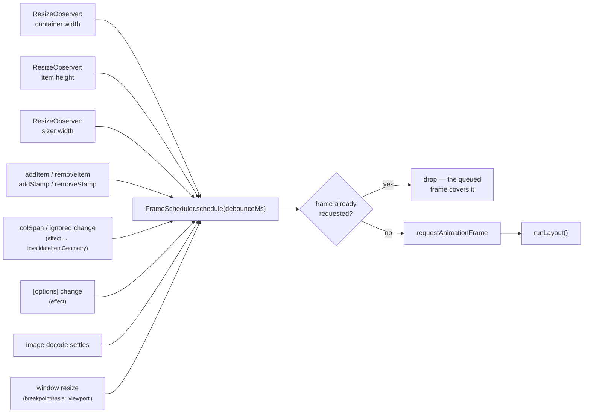

`FrameScheduler` is ~70 lines and does exactly three things:

1. **Coalesce.** `schedule()` is idempotent within a frame — `if (this.frame !== 0) return`. A burst
   of a hundred appended items costs one layout pass, not a hundred.
2. **Debounce, selectively.** `schedule(debounceMs)` restarts a `setTimeout` and only then requests
   the frame. `SizeWatcher` reports whether a batch of entries changed the *geometry* — the width
   source or the sizer — and only that case is debounced; item measurements always pass `0`:

   ```ts
   // masonry-grid.ts, the SizeWatcherHost.onChange implementation
   private onSizeChange(geometryChanged: boolean): void {
     this.scheduler.schedule(geometryChanged ? this.options().resizeDebounce : 0);
   }
   ```

   A debounced item measurement would make newly added content visibly lag; a debounced container
   resize just avoids re-solving mid-drag. Note where the decision lives: the watcher classifies the
   entry, the component owns the policy, and the scheduler knows neither.

3. **Stay cancellable.** `cancel()` clears both the frame and the timer, `destroy()` latches so a
   late callback after teardown is a no-op.

### The one observer

`SizeWatcher` owns a single `ResizeObserver` for the container, every item, every stamp, and the
sizer — not one per element. A single observer with many targets is markedly cheaper, and its
entries carry sizes the browser has already computed, so reading them **forces no reflow**:

```ts
function contentWidthOf(entry: ResizeObserverEntry): number {
  const box = entry.contentBoxSize?.[0];
  return box ? box.inlineSize : entry.contentRect.width;
}
```

Demultiplexing is by identity, and by elimination: `onResize()` compares each entry's target against
the width source and against the sizer, and anything that is neither is an item. That is the whole
reason `SizeWatcher` never needs the registry — it does not have to know what an item *is*, only
what the other two are.

Box modes are chosen per role:

| Target                            | Box           | Why                                    |
| --------------------------------- | ------------- | -------------------------------------- |
| Width source (host or its parent) | `content-box` | Column math works in content-box space |
| Sizer element                     | `content-box` | Its width _is_ the column width        |
| Items                             | `border-box`  | Stacking needs the outer height        |
| Stamps                            | `border-box`  | Items must flow around the whole box   |

### The `fitWidth` feedback loop, and how it is broken

`fitWidth` shrinks the host to the width the columns actually occupy. Observing the host would then
feed the grid's own write back in as the next pass's input — an oscillation.
`SizeWatcher.syncWidthSource()` observes the **parent** instead whenever `fitWidth` is on, so the
loop cannot form:

```ts
const wanted = (options.fitWidth ? this.element.parentElement : this.element) ?? this.element;
```

It is re-evaluated at the top of every pass, so toggling `fitWidth` at runtime re-points the
observer.

---

## Anatomy of a layout pass

`runLayout()` is the heart of the library. It is also, since the split, almost entirely delegation:
forty lines that call eight collaborators in one fixed order. The strict ordering is the reason a
pass costs at most one forced reflow.

| Step | What happens                            | Who does it                                    | File                       |
| ---- | --------------------------------------- | ---------------------------------------------- | -------------------------- |
| 1    | Which items, in page order              | `ItemRegistry.collectOrdered()`                | `core/item-registry.ts`    |
| 2    | Container / viewport / sizer / heights   | `SizeWatcher` (already in memory) + `stampBoxes()` | `core/size-watcher.ts`, `core/item-registry.ts` |
| 3    | Width → column count and column width   | `resolveColumnGeometry()`                      | `core/column-resolver.ts`  |
| 4    | Give every item its width               | `ItemStyles.writeWidths()`                     | `core/item-styles.ts`      |
| 5    | Would this pass change anything?        | `layoutSignature()`                            | `core/layout-signature.ts` |
| 6    | Heights and spans → coordinates         | `MasonryLayoutEngine.solve()`                  | `core/layout-engine.ts`    |
| 7    | Write the coordinates as transforms     | `ItemStyles.writePosition()` / `promote()`     | `core/item-styles.ts`      |
| 8    | Entry effects, movement transitions     | `Motion.playEntry()` / `enableTransitions()`   | `core/motion.ts`           |

Steps 1–3 only read from the DOM; steps 4–8 only write to it.

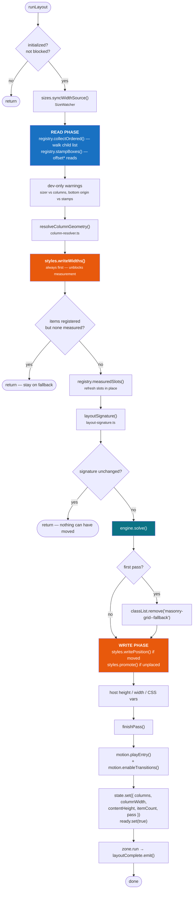

### Read phase

Only two things are read from the DOM, and neither is per-item geometry. Both belong to
`ItemRegistry`:

- **`collectOrdered(onIgnored)`** walks `container.children` and looks each child up in the records
  map. Order therefore comes from the **DOM**, not from registration order — which is why
  insertions, removals and `@for` reorderings keep items in source order without any
  `reloadItems()` call. Ignored items are reported through the `onIgnored` callback, which the
  component wires to `ItemStyles.demote()`; unmeasured or still-decoding items sit the pass out.
  Note the shape of that callback: the registry decides *that* an item has opted out, and
  `ItemStyles` decides what opting out looks like in CSS.
- **`stampBoxes()`** reads `offsetLeft/Top/Width/Height`, but only when stamps exist. A grid without
  stamps reads nothing at all in this phase. This is the one place geometry is read straight from
  the DOM rather than from an observer, because a stamp's *position* matters and no observer reports
  position.

Item heights and the container width never appear here: they arrived asynchronously through
`SizeWatcher`'s `ResizeObserver` and are already in memory.

`measuredSlots(ordered)` sits on the boundary between the phases. It is not a DOM read — it copies
each record's height and span into reused `MeasuredSlot` objects, the shape the solver wants — but
it runs after `writeWidths()` because the early return above it must not be taken until widths are
out.

### Write phase, and why `writeWidths()` comes first

`ItemStyles.writeWidths()` runs **before** the "nothing is measured yet" early return. That ordering
is
load-bearing: an item cannot report its real height until it has been given its column width, so
this write is what unblocks the measurement the _next_ pass consumes.

Each write is guarded against redundancy:

```ts
if (record.lastWidth !== width) {
  record.lastWidth = width;
  style.width = `${width}px`;
}
```

...and the whole walk is skipped when the geometry is unchanged and nothing was added, removed or
respanned:

```ts
// ItemStyles.writeWidths()
const geometryUnchanged =
  columns === this.lastColumns &&
  columnWidth === this.lastColumnWidth &&
  options.gutterX === this.lastGutterX;
if (geometryUnchanged && !this.dirty && !options.contentVisibility) return;
```

`dirty` is set by `ItemStyles.invalidate()`, which the component calls when an item is added,
removed, re-spanned or ignored — the events that change what needs writing without changing the
geometry.

`contentVisibility` is the deliberate exception: `contain-intrinsic-size` encodes the _measured
height_, which changes far more often than the width does. A stale value makes the browser
mis-report the size of everything it skipped, and the scrollbar jumps as those items scroll in.

Positions are written as 2D `transform`, not `top`/`left`:

```ts
record.handle.element.style.transform = `translate(${x.toFixed(2)}px, ${y.toFixed(2)}px)`;
```

`translate` rather than `translate3d` is intentional — a very long grid would otherwise promote
every item to its own compositor layer.

---

## Bootstrap: why the first layout takes two passes

Nothing has a height until it has a width. The grid therefore reaches a stable layout through two
passes joined by an asynchronous observer callback.

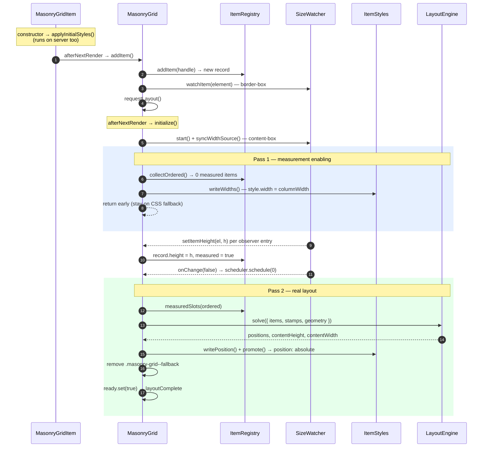

The early return in pass 1 — `if (this.registry.itemCount > 0 && ordered.length === 0) return` — is
what prevents a visible flash of an empty grid: the multi-column fallback keeps painting until there
is something real to show.

---

## Column geometry resolution

`resolveColumnGeometry()` is a pure function of `(availableWidth, basisWidth, options, sizerWidth)`.
There are two branches, and precedence between them is the part worth knowing.

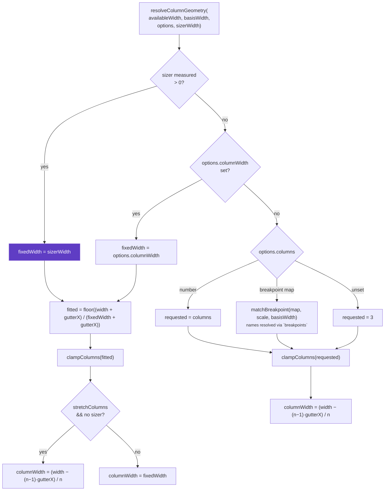

Three details:

- **A sizer wins over everything.** It states the column width explicitly, so `stretchColumns` is
  suppressed in that branch (`sizerWidth === undefined` in the condition) — stretching would
  contradict what the stylesheet said. A development-mode warning fires if `columns` or
  `columnWidth` is set alongside a sizer.
- **`clampColumns`** applies `minColumns` and `maxColumns` with a hard floor of 1:
  `Math.max(1, Math.min(Math.max(count, minColumns), maxColumns ?? ∞))`.
- **Breakpoint keys are resolved and sorted once per object.** A key is either a raw minimum width
  or a name in the `breakpoints` scale (`sm`, `lg`, …), so `resolveStops` turns the map into sorted
  `[width, count]` pairs and caches them in a `WeakMap` keyed by the map's identity — a
  `{ sm: 1, lg: 3 }` literal costs one parse and sort for its lifetime rather than one per pass. The
  cache entry stores the scale it was resolved against and is rebuilt if that reference changes,
  since a name means nothing without it. `matchBreakpoint` then selects the largest stop at or below
  the basis width, where the basis is the container or the viewport per `breakpointBasis`.

---

## The solver

[`MasonryLayoutEngine.solve()`](projects/masonry-angular/src/lib/core/layout-engine.ts) maintains
one number per column — the next free Y offset — and walks the items once.

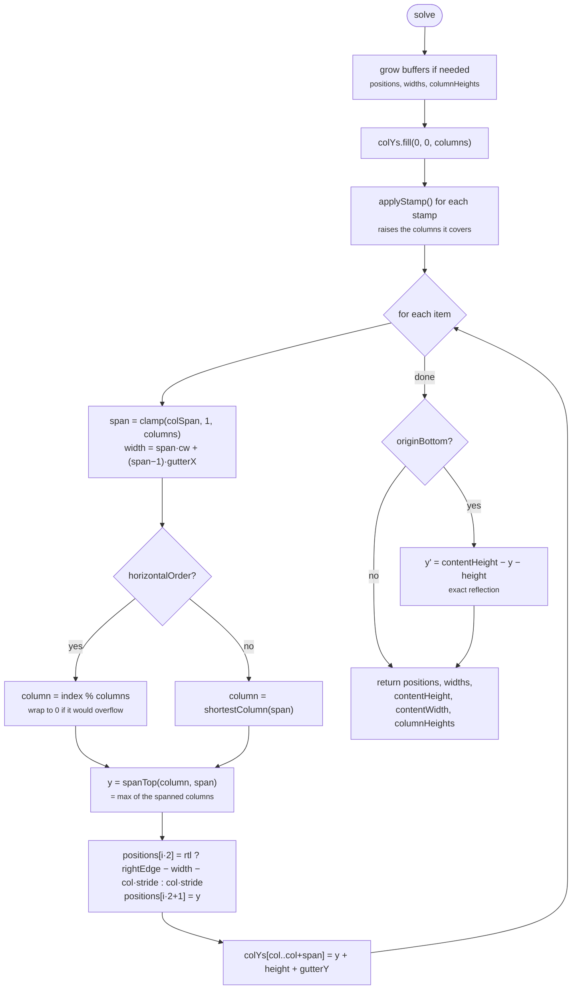

### Column choice

```ts
// Index of the column group of `span` columns with the lowest top offset.
for (let c = 0, last = columns - span; c <= last; c++) {
  const y = this.spanTop(colYs, c, span);
  if (y < bestY - EPSILON) {
    bestY = y;
    bestColumn = c;
  } // strict improvement only
}
```

The `EPSILON` (0.001) comparison with _strict_ improvement is what makes ties resolve
left-to-right deterministically — without it, floating-point noise in measured heights would let
equal columns swap between passes and items would visibly jitter.

### Gutters are baked into the column height

```ts
const next = bottom + gutterY;
for (let c = column, end = column + span; c < end; c++) colYs[c] = next;
if (bottom > contentHeight) contentHeight = bottom;
```

Storing the _next free offset_ rather than the bottom edge means the gutter never trails at the
bottom of the grid: `contentHeight` tracks the true bottom, while `colYs` already includes the gap
the next item needs.

### `verticalOrigin: 'bottom'` is a reflection, not a second algorithm

The solve is unchanged; the finished coordinates are mirrored about `contentHeight`. Reflecting a
packing is _exact_ rather than approximate — it produces precisely the packing you would get by
filling from the other edge. The known limitation is stamps: they are resolved against the top edge
and then mirrored with everything else, so items flow around the wrong region. A development-mode
warning says so rather than silently misplacing content.

### RTL

RTL is also pure arithmetic, applied at write time inside the solver:

```ts
const rightEdge = Math.max(containerWidth, columns * stride - gutterX);
positions[i * 2] = rtl ? rightEdge - width - column * stride : column * stride;
```

### Buffers

`positions`, `widths` and `columnHeights` are `Float64Array`s that grow geometrically
(`max(needed, length * 2)`) and are **reused between passes**. The returned solution aliases them —
they are read immediately in the write phase and never retained, which is what makes a steady-state
relayout of an unchanged grid allocate nothing.

---

## The signature: skipping work that would change nothing

`layoutSignature()`, in [`core/layout-signature.ts`](projects/masonry-angular/src/lib/core/layout-signature.ts),
folds every input to `solve()` into one 32-bit integer using the classic `hash * 31 + x`
accumulation, with floats rounded to 1/100 px (`PRECISION = 100`) so sub-pixel jitter in a
measurement does not read as a real change.

```ts
const signature = layoutSignature(
  geometry,
  options,
  measured,
  stamps,
  this.sizes.containerWidth,
  this.sizes.sizerWidth,
);
if (signature === this.signature) return; // identical inputs ⇒ identical output
this.signature = signature;
```

**Six positional arguments rather than one options object, deliberately.** This function runs on the
hot path — on every frame of a window drag, including every frame it is about to *skip* — so an
object literal at the call site would allocate on each one. That would be an allocation to decide
not to allocate anything, which is precisely the cost the signature exists to avoid. Six parameters
is the price of keeping a skipped pass genuinely free.

What goes in: column count, column width, **container width**, sizer width, both gutters,
`horizontalOrder`, `direction`, `verticalOrigin`, item count, every item's height and span, and
every stamp's box.

The container width looks redundant next to the geometry, and is not: in an RTL pass items anchor
to the right edge, so with a fixed `columnWidth` the container can resize — moving every item —
while the column count and column width stay exactly the same.

Three conventions:

- `FORCE_NEXT_LAYOUT` (the value `0`) is a **force sentinel**. `layout()`, the options `effect` and
  a sizer change set `this.signature = FORCE_NEXT_LAYOUT`, and the hash never returns 0
  (`return hash === 0 ? 1 : hash`), so a forced pass can never be mistaken for an unchanged one.
- The check sits _after_ `writeWidths()`, so a skipped pass still keeps item widths correct.
- It is a hash, so two different layouts could in principle collide. The inputs are a handful of
  rounded measurements and the cost of a collision is one stale frame rather than corruption — the
  next real change produces a different number and repairs it.

Because the hash is the gate on the whole write phase, **any new input to `solve()` has to be folded
in here too.** The failure mode is silence: the grid looks right whenever something else also
changed, and stale the rest of the time. `layout-signature.spec.ts` is where that guard is written.

This is what makes a resize drag cheap: the observer fires on every frame, but only the frames where
the geometry actually crosses a threshold do any solving or DOM writing.

---

## Item lifecycle

An item is a `MasonryGridItem` directive plus an `ItemRecord` held by `ItemRegistry`. The record
carries the last values written to the DOM, so an unchanged pass writes nothing. The registry owns
the record; `ItemStyles` is the only thing that writes to the element it points at.

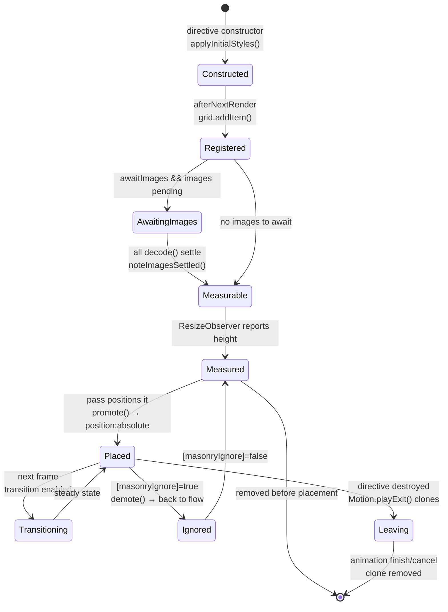

Three subtleties:

**`applyInitialStyles()` runs in the constructor, not `afterNextRender`** — so it executes on the
server too. With `ssr.fallback: 'columns'` it sets `break-inside: avoid; width: 100%`, which is what
makes the server response a usable multi-column page; with `'none'` it sets `visibility: hidden`
rather than flashing an unstyled stack.

**Images are awaited with `decode()`, never `load`.** `decode()` resolves only once the frame is
ready to paint, so the height measured is the height that will render. Lazy images are deliberately
_never_ awaited — one still off-screen would never resolve and would strand the item forever:

```ts
if (image.complete || image.loading === 'lazy' || !image.currentSrc) continue;
pending.push(image.decode().catch(() => settled(image)));
```

The pending count is also released in `onDestroy`, because an item torn down mid-decode would
otherwise hold `itemsLoaded` back permanently.

**Ignoring is reversible.** `ItemStyles.demote()` is the exact inverse of `promote()`: it clears
position, margin, width, transform, transition and the `contain-intrinsic-size` bookkeeping, and
resets `lastWidth`/`lastX`/`lastY` to sentinels so the next placement writes everything fresh. The
two live next to each other in `core/item-styles.ts` for exactly that reason — a property added to
one and forgotten in the other is a bug you can see, and only if you are looking at both.

---

## Motion model

All three effects live in [`core/motion.ts`](projects/masonry-angular/src/lib/core/motion.ts). The
`Motion` object is handed the container element and a single `onExitSettled` callback, and that is
the entire extent of what it knows about the grid — it never positions anything, it decorates moves
the pass has already made. Everything in it degrades quietly: no Web Animations API, a `0` duration,
or a `false` config, and the effect simply does not play while the layout is unaffected.

Three independent mechanisms, each with a different job:

| Mechanism    | Applies to           | Implementation                      | Why this one                                    |
| ------------ | -------------------- | ----------------------------------- | ----------------------------------------------- |
| **Entry**    | Newly placed items   | Web Animations, `fill: 'backwards'` | Staggered per batch, capped by `maxStagger`     |
| **Movement** | Already-placed items | CSS `transition: transform`         | Compositor-only; browser owns the interpolation |
| **Exit**     | Removed items        | Web Animations on a **clone**       | The real element is already detached            |

### Why exits animate a clone

Angular detaches an element as soon as its directive is destroyed, so by the time `removeItem()`
runs there is nothing left on screen to animate. `Motion.playExit()` clones the node — the clone
inherits the inline position, width and transform `ItemStyles` wrote, which is exactly what makes it
land where the item was — appends it to the host, animates that, and discards it on `finish` or
`cancel`:

```ts
const clone = record.handle.element.cloneNode(true) as HTMLElement;
clone.classList.add('masonry-item--leaving');
clone.setAttribute('aria-hidden', 'true');
clone.style.pointerEvents = 'none'; // scenery: no pointer input
clone.style.transition = ''; // must not inherit the position transition
```

Consequences worth knowing: the clone is inert (no component state, no event handlers), it is hidden
from assistive technology, and it is removed on teardown before any `finish` event can fire. Two
flags cooperate to keep that quiet — the component latches its own `destroyed` _first_ in the
`onDestroy` handler, before calling `motion.destroy()`, and `Motion` latches its own before
cancelling the clones it holds — so an animation cancelled on the way out cannot emit
`removeComplete` at a grid that no longer exists.

### Why the transition is enabled one frame late

An item placed with `transition: transform` already active would slide in from the origin. So
`ItemStyles.promote()` positions it, and only on the **next** frame does `Motion.enableTransitions()`
set the transition property:

```ts
this.transitionFrame = requestAnimationFrame(() => {
  this.transitionFrame = 0;
  const value = `transform ${duration}ms ${easing}`;
  for (const record of this.transitionQueue) {
    if (record.transitioned) continue;
    record.transitioned = true;
    record.handle.element.style.transition = value;
  }
  this.transitionQueue.length = 0;
});
```

Only `transform` is transitioned. Transitioning `width` would relayout every item on every frame of
a resize.

### `removeComplete` accounting

Removals reach the same counter by two routes, and the event fires once per batch:

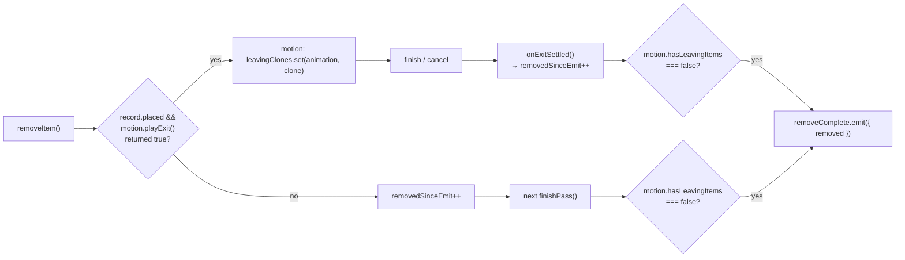

The division of labour is worth noticing: `Motion` knows when a clone has settled and nothing about
counting; the component keeps `removedSinceEmit` and decides when a batch is complete. `playExit()`
returning `false` — no animation configured, no Web Animations API, or the grid already torn down —
is what routes an un-animated removal down the left-hand branch.

Un-animated removals are reported from `finishPass()` rather than immediately — the event then means
"the gap has actually closed", not merely "the directive was destroyed".

---

## Options pipeline

There are six configuration inputs — `columns`, `columnWidth`, `gutter`, `gutterX` and `gutterY`,
plus the raw `[options]` object — and exactly one thing reads them: the `options()` computed.
Everything else in the component, and every directive through `MasonryGridHost`, reads `options()`
and never an input.

The computed itself is two lines. All of the work is in `GridOptionsResolver`
([`core/grid-options.ts`](projects/masonry-angular/src/lib/core/grid-options.ts)), which is
constructed with the application defaults and then answers one question — *given this `[options]`
value and these shorthands, what is in effect?* — over and over:

```ts
private readonly optionsResolver = new GridOptionsResolver(inject(NG_MASONRY_GRID_DEFAULTS));

readonly options: Signal<ResolvedMasonryGridOptions> = computed(() =>
  this.optionsResolver.resolve(this.optionsInput(), {
    columns: this.columns(),
    columnWidth: this.columnWidth(),
    gutter: this.gutter(),
    gutterX: this.gutterX(),
    gutterY: this.gutterY(),
  }),
);
```

The resolver is a plain class with no Angular in it: DI supplies the defaults, the component supplies
the two changing sources, and the object holds only the small amount of state the identity cache
needs. It is testable with two calls and an `expect(a).toBe(b)`.

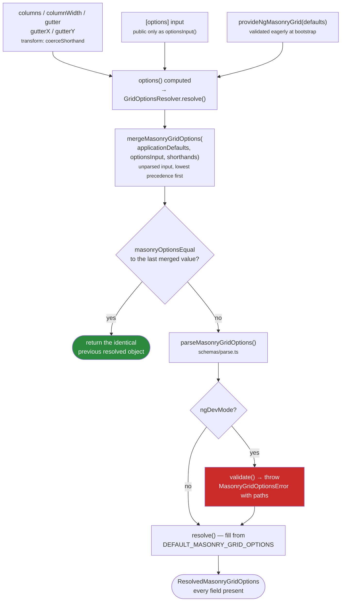

The split between the two files is by what changes. `core/grid-options.ts` owns *precedence and
memoisation* — which source wins, and whether anything actually changed since last time.
`schemas/parse.ts` owns *the option vocabulary* — what fields exist, what they may contain, and what
they default to. Adding an option touches the second; changing how the sources layer touches the
first.

**The shorthands are ordinary inputs with a coercion transform.** `coerceShorthand` (exported from
`core/grid-options.ts` alongside the resolver, since it is the other half of the same job) turns the
string an HTML attribute produces into a number, which is what lets `columns="3"` work with no binding and
no object literal, while `[columns]="{ '0': 1, '768': 3 }"` passes through untouched. A string that is
_not_ a number is deliberately passed through as well rather than coerced to `NaN`: the dev-mode
validator downstream then reports it with a precise path, which is far more useful than a silently
wrong column count.

**Precedence is the argument order of one merge call.** Application defaults, then `[options]`, then
whichever shorthands are set — so the narrowest declaration wins, and a grid can override one field
of an application-wide configuration without restating the rest.

**Merging happens before validation, on unparsed input.** That is what lets a component override a
single field of a nested group without restating its siblings — `{ ssr: { columns: 3 } }` keeps the
provided `fallback`. `mergeMasonryGridOptions` also clears the counterpart when one of the mutually
exclusive `columns` / `columnWidth` pair is set at any layer, so a `columnWidth="260"` attribute
retires an inherited `columns` map instead of tripping the exclusivity check against it.

**Identity caching is what makes inline literals free.** `[options]="{ gutter: 16 }"` allocates a
fresh object on every change detection run, so the merge produces a fresh object too.
`GridOptionsResolver.resolve()` compares that merged object structurally against the last one it saw
(`masonryOptionsEqual`) and, on a match, returns the _identical_ previous
`ResolvedMasonryGridOptions`. A `computed` compares its new value to its old with `Object.is`, so an
identical reference means the computed did not change: no dependent `computed` recomputes, the
options `effect` does not re-run, and no layout pass is queued. The deep compare is the price, and it
is paid once per change detection run instead of once per pass.

**Validation is development-only, by construction.** Every check is inside
`if (typeof ngDevMode === 'undefined' || ngDevMode)`. Production builds replace `ngDevMode` with
`false`, so the validator and everything reachable only from it is dropped by the bundler. This is
the reason the library hand-writes types and defaults instead of deriving both from a schema
library: a schema runtime would ship to every user, and the only thing it would do in production is
catch mistakes the application developer already made in TypeScript.

`DEFAULT_MASONRY_GRID_OPTIONS` (in `schemas/defaults.ts`) is a deeply `Object.freeze`d single
source of truth, tagged `satisfies ResolvedMasonryGridOptions` — the type it fills in lives in
`models/options.ts` — and a test asserts the two stay in step.

---

## Change detection and zones

The grid is `ChangeDetectionStrategy.OnPush` and works identically zoneful or zoneless.

- **All plumbing runs outside Angular.** Every call into `SizeWatcher` that constructs the observer,
  registers the `resize` listener or adds a target is wrapped in `zone.runOutsideAngular()` by the
  component — `SizeWatcher.start()` says so in a comment because it cannot enforce it itself. A
  `ResizeObserver` callback firing on every frame of a drag therefore never schedules change
  detection.
- **Signals are the notification channel.** `finishPass()` writes `state` — one object carrying
  `columns`, `columnWidth`, `contentHeight`, `itemCount` and `pass` — and then `ready`. Writing a
  signal is what makes a zoneless application re-render, and the host bindings
  (`--masonry-gutter-x`, `.masonry-grid--ready`, …) read from signals and `computed`s. One write
  rather than five also means a template reading two fields of the last pass cannot observe them
  disagreeing.
- **`zone.run()` wraps only output emissions** — `layoutComplete`, `removeComplete`, `itemsLoaded`.
  It is a no-op under zoneless change detection and the correct bridge back into Angular for
  zone-based applications, so a consumer's handler runs in the zone it expects.

The one imperative DOM write that bypasses signals is removing `masonry-grid--fallback` on the first
pass. A host-binding update lands on the next change detection — a frame in which items are already
transformed but still in normal flow, which reads as a visible jump. The class is therefore removed
inside the same synchronous write phase, and the `usesFallback()` computed agrees a moment later.

---

## Server-side rendering and the fallback handoff

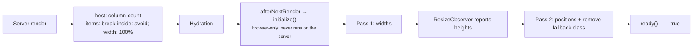

`afterNextRender` is browser-only, which doubles as the SSR guard: the server renders the CSS
multi-column approximation and never constructs an observer. Multi-column is not true masonry — it
fills top to bottom per column — but it uses the right gaps and column count, so the server response
is useful without JavaScript and hydration swaps in the real layout without a shift.

`ssr.fallback: 'none'` opts out; items then stay `visibility: hidden` until the first client pass.
When using the `'columns'` fallback, set `entryAnimation.animateInitial: false` — the items are
already painted, so animating them in is a regression, not a flourish.

---

## Native layout: handing the grid to the browser

With `native: true`, a browser that implements CSS masonry does the entire layout and the library
withdraws. Everything below is about how the withdrawal is arranged so that it is correct on the
server, correct before hydration, and complete rather than partial.

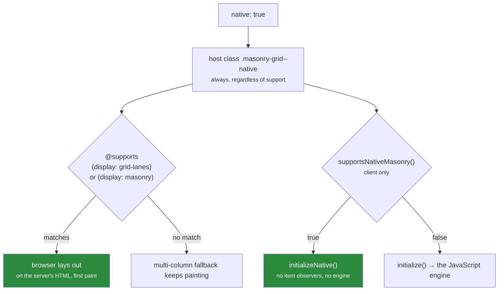

### The switch is in CSS; the JavaScript only agrees with it

The decision that matters is made by an `@supports` rule in the component's `styles`, not by
JavaScript. That is the whole point of the feature. A `@supports` rule is evaluated by the browser
as it parses the stylesheet, so a server-rendered document is laid out — really laid out, not
approximated — on first paint, with no measuring pass and nothing to hydrate. A JavaScript check
could not achieve that at any speed: the server does not know what the visitor's browser supports,
and by the time the client had found out, the first paint would already be on screen.

The host class `.masonry-grid--native` is bound to `options().native` alone, never to feature
detection, so it is present in every browser and the stylesheet is free to decide. Multi-column
properties do not apply to a grid container, so the fallback's `column-count` goes inert on its own
in the browsers where a rule wins — the two renderings cannot both be live, and nothing has to
sequence them.

JavaScript feature-detects anyway, in `supportsNativeMasonry()`, because it has a different question
to answer: not "how should this paint" but "must the engine run". `nativeActive()` — `options().native
&& supportsNativeMasonry()` — is what gates observers, measurement and the solver. The two are
separate expressions of one question and have to be kept in step, because a mismatch is broken in
either direction: a stylesheet that matched while the JavaScript did not would leave the engine
positioning items inside a grid the browser is already packing, and JavaScript that matched while no
rule did would leave the grid unpositioned. Both spellings are therefore tested in both places, and
only those spellings:

- `display: grid-lanes` — the syntax the CSS Working Group settled on and what Safari 26.4 ships.
- `display: masonry` — Chromium's earlier prototype, still what its flag exposes. It takes the same
  `grid-template-columns` and `gap`, so the two `@supports` blocks are identical declarations and a
  browser silently drops the one it cannot parse.

Firefox's `grid-template-rows: masonry` is deliberately excluded. It is a different mechanism —
masonry as a track-sizing mode on a regular grid, rather than a display type — it is behind a
non-default flag, and it is being replaced by `grid-lanes` rather than shipped. Accepting it would
mean a second code path with its own semantics, maintained for a syntax that is on its way out.
Those browsers get the JavaScript engine, which is the correct answer for them.

### What `initializeNative()` and `runNativeLayout()` do

`initialize()` forks immediately on `nativeActive()`, so the native path never constructs the
observer that watches items, never registers the viewport listener, and never reaches `runLayout()`.

`initializeNative()` does three things and stops: it emits the dev-mode warning for options the
browser cannot honour, it asks `SizeWatcher.watchContainerOnly()` for one container observer
**only** if the column count is breakpoint-driven, and it drops the fallback class.
`runNativeLayout()` is what a "pass" means in this mode: `resolveNativeColumns()` for the count,
publish `state`, set `ready`, emit `layoutComplete`. There is no read phase, no signature, no solve,
and no write to any item — the registry, `ItemStyles` and `Motion` are never touched.

The column count is resolved three ways by `resolveNativeColumns()` in
[`core/native-grid.ts`](projects/masonry-angular/src/lib/core/native-grid.ts), and only one of them
costs anything:

| `columns` / `columnWidth` | `grid-template-columns`                   | How the count is known                          |
| ------------------------- | ----------------------------------------- | ----------------------------------------------- |
| `columnWidth: 260`        | `repeat(auto-fill, minmax(min(100%, 260px), 1fr))` | `countNativeColumns()` reads the computed style, for reporting only |
| `columns: 4`              | `repeat(4, 1fr)`                          | It is the option                                |
| `columns: { 0: 1, … }`    | `repeat(n, 1fr)`                          | One container `ResizeObserver` → `resolveColumnGeometry` |

`native-grid.ts` exists as a separate file from `native.ts` because the two answer different
questions. `native.ts` is about the *browser* — what it supports, and what CSS to hand it — and is
imported by the component's host bindings on every grid. `native-grid.ts` is about a *grid* — which
of the three routes above applies to this configuration — and is the only one that needs the column
resolver.

The first two are what `nativeColumnsAreStatic()` recognises: a single declaration that already
describes the whole responsive behaviour, so the browser re-lays-out on resize, on content changes
and as images decode without anyone being told. A breakpoint map is the one case CSS cannot express
on its own, because the counts are the application's rather than derived from a track size — so that
grid, and only that grid, keeps one observer alive to re-evaluate which stop applies. It observes
the container, never an item.

`state().columnWidth` is `0` under native layout. The browser owns the track sizes and does not
report them; publishing a number the library did not compute would be a fabrication, and `0` is the
honest answer. The count, by contrast, is real — for a `columnWidth` grid it is read once per pass
from the resolved `grid-template-columns`, which is an already-computed value and the only place the
browser's `auto-fill` decision is visible.

Items are still registered, so `items()` and `state().itemCount` stay truthful, but their records are
inert: never observed, never measured, never promoted to absolute positioning.

### What changes in the item directive

The item directive is where the withdrawal has to be complete rather than partial, because it runs
before the grid has done anything.

- **No hidden state.** `applyInitialStyles()` treats a `native` grid exactly like the multi-column
  fallback — `break-inside: avoid; width: 100%` — and never `visibility: hidden`, whatever
  `ssr.fallback` says. In a browser with `grid-lanes` the server's HTML is already correctly laid
  out, so hiding items would hide a finished layout waiting for a script that has nothing to do; in a
  browser without it, these are precisely the styles the fallback needs. Both properties are
  harmless inside a grid container, so this runs in the constructor with no feature detection at all.
- **Spans go to the browser.** Instead of the grid computing a pixel width from the span, the
  directive writes `grid-column: span n` on its own element and the browser resolves it. The property
  is inert in a non-grid container, so it too can be written before detection has an answer.
- **No image awaiting.** `awaitImages()` returns early when `nativeActive()`. The reason to hold an
  item back is that the engine must measure it at its final height; a browser that re-packs when an
  image changes an item's height needs no such promise, and creating one per image would cost
  something to buy nothing.

---

## Performance invariants

These are the properties the implementation is built to preserve. Breaking one is a regression even
if every test still passes.

| Invariant                                       | Enforced by                                                                  |
| ----------------------------------------------- | ---------------------------------------------------------------------------- |
| At most one layout pass per animation frame     | `FrameScheduler` idempotent `schedule()`                                     |
| Reads never interleave with writes              | Phase ordering in `runLayout()`                                              |
| No forced reflow when there are no stamps       | Sizes come from `ResizeObserverEntry` via `SizeWatcher`, not `getBoundingClientRect()` |
| A no-op pass allocates nothing                  | Reused `Float64Array`s in the engine, reused `MeasuredSlot` objects and scratch arrays in `ItemRegistry`, positional arguments to `layoutSignature()` |
| A no-op pass writes nothing                     | Signature check + per-property `last*` guards in `ItemStyles`                |
| A resize drag does not re-solve every frame     | Signature check + `resizeDebounce`                                           |
| One observer, not one per item                  | `SizeWatcher`'s single `ResizeObserver` with many targets                    |
| Repositioning stays off the layout/paint path   | 2D `transform`, `transition: transform` only                                 |
| Long grids do not promote every item to a layer | `translate`, not `translate3d`                                               |
| Breakpoint keys are sorted once per map         | `WeakMap` cache keyed by object identity                                     |
| Validation costs production zero bytes          | `ngDevMode` guards                                                           |
| Native layout observes nothing for a static column configuration | `nativeColumnsAreStatic()` — `columnWidth` and a fixed `columns` are each one CSS declaration |
| Native layout observes at most the container    | The breakpoint-map branch of `initializeNative()`; no item is ever observed  |
| Native layout does no per-item work at all      | `nativeActive()` forks before `addItem()` measures, before `runLayout()` solves, and before `awaitImages()` allocates |

The scratch buffers reused across passes live with the objects that fill them — `orderedBuffer`,
`measuredBuffer` and `stampBoxBuffer` in `ItemRegistry`, `entering` in the component. All are
truncated with `.length = 0` rather than reallocated, and `measuredSlots()` mutates the existing slot
objects in place:

```ts
// ItemRegistry.measuredSlots()
const slot = (slots[i] ??= { height: 0, colSpan: 1 });
slot.height = record.height;
slot.colSpan = record.handle.colSpan();
```

That the slots are shared and overwritten is why the solver is careful never to retain one, and why
`layoutSignature()` reads them immediately rather than keeping a copy to compare against next time.

---

## Testing model

jsdom implements neither `ResizeObserver`, nor real layout, nor the Web Animations API. The
`masonry-angular/testing` entry point supplies deterministic doubles for all three, which is what
makes the multi-pass behaviour assertable.

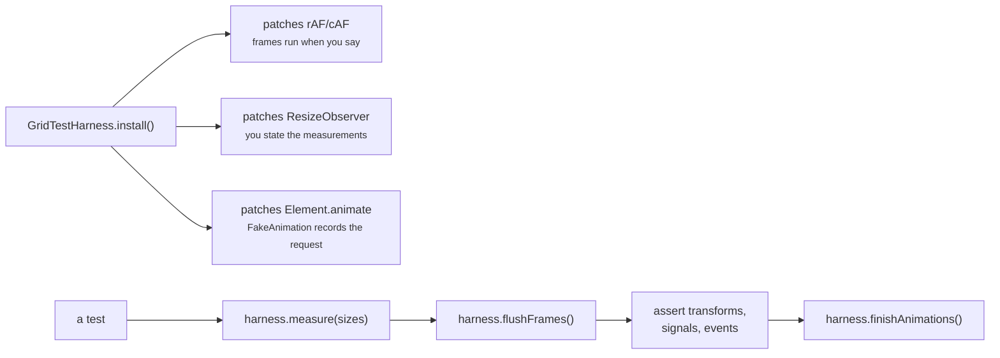

`flushFrames()` drains repeatedly (up to `maxRounds`) because a pass can schedule another frame —
the deferred transition-enabling frame, for instance. `measure()` reports sizes to every observer
watching the given elements, which is how a test drives the exact two-pass sequence the browser
would produce.

The pure modules are tested directly and need none of this: `layout-engine.spec.ts`,
`column-resolver.spec.ts`, `layout-signature.spec.ts` and `native.spec.ts` are plain function tests,
and `options.spec.ts` covers merge, validation and structural equality.

Splitting the component moved a good deal of behaviour out from behind the harness. `ItemRegistry`
owns the DOM-ordering logic everything else depends on, and `item-registry.spec.ts` exercises it
against a plain container element with stub handles — no `TestBed`, no fixture, no frames. That is a
large part of why the suite grew from 155 tests to 185: behaviour that previously could only be
reached through a rendered grid now has a front door.

What still needs the harness is what genuinely involves the component: pass sequencing, signals,
outputs, and the interaction between them.

---

## Extension points

The public API deliberately exposes more than the component, so the pieces are reusable
independently:

| Export                                                                      | Use                                                                |
| --------------------------------------------------------------------------- | ------------------------------------------------------------------ |
| `MasonryLayoutEngine`                                                       | Solve a layout in a worker, on the server, or in another framework |
| `resolveColumnGeometry`, `resolveFallbackColumns`                           | Reuse the responsive column math anywhere                          |
| `FrameScheduler`                                                            | Coalesce your own invalidations onto a frame                       |
| `MasonryGridHost`, `MasonryItemHandle`                                      | Implement a custom host, or mock the grid in tests                 |
| `parseMasonryGridOptions`, `mergeMasonryGridOptions`, `masonryOptionsEqual` | Validate or compose options ahead of time                          |
| `supportsNativeMasonry`                                                     | Branch on native CSS masonry without repeating the feature test    |
| `NG_MASONRY_GRID`                                                           | Import every directive in one line                                 |

Because `MasonryGridHost` is an abstract class rather than an interface, it is both the DI token and
the contract — a custom implementation can be provided under it and the stock item, stamp and sizer
directives will drive it unmodified.

The collaborators added by the split — `ItemRegistry`, `SizeWatcher`, `ItemStyles`, `Motion`,
`GridOptionsResolver`, `layoutSignature` — are deliberately **not** exported. They are internal
seams, useful for reading and testing this library rather than for building on: each assumes the
pass ordering in `runLayout()`, and several hand out buffers that are overwritten on the next pass.
Splitting the component was not a decision to widen the public API.

---

## Design decisions and their trade-offs

| Decision                                                | Bought                                                                 | Cost                                                                              |
| ------------------------------------------------------- | ---------------------------------------------------------------------- | --------------------------------------------------------------------------------- |
| Pure solver, isolated from Angular and the DOM          | Trivial unit tests, worker/SSR reuse, enforced read/write split        | Component must marshal state in and coordinates out                               |
| Component split into single-purpose collaborators       | Each file readable and testable alone — `ItemRegistry`'s ordering, `ItemStyles`' writes and `GridOptionsResolver`'s caching no longer need a rendered grid; 185 tests instead of 155 | ~0.5 KB gzipped (8.1 → 8.6 KB; it cost 0.8 KB until a dev-mode leak the split introduced was reclaimed — see below), and more indirection: no single file describes a whole pass any more |
| Order derived from the DOM child list, not registration | Insertions, removals and `@for` reorders just work; no `reloadItems()` | One child-list walk per pass                                                      |
| Single shared `ResizeObserver`                          | Far cheaper than one per item; reflow-free sizes                       | Callback must demultiplex targets by identity                                     |
| Integer signature over the inputs                       | Whole passes skipped for free                                          | Every new solver input must be folded in, or staleness results                    |
| Hand-written validation behind `ngDevMode`              | Precise dev errors; zero production bytes                              | Types, defaults and validators must be kept in step manually (a test guards this) |
| Exit effects animate a clone                            | Exits are possible at all under Angular's teardown order               | Clone is inert; the effect cannot react to component state                        |
| `verticalOrigin: 'bottom'` implemented as a reflection  | Exact, and one code path instead of two                                | Stamps are unsupported in that mode (dev warning)                                 |
| `transform` for position, CSS transition for movement   | Compositor-only movement; no layout thrash                             | Consumer keyframes must use `translate`/`scale`/`rotate`, never `transform`       |
| Structural identity caching on the merged options       | Inline object literals cost nothing                                    | A deep compare on each change detection run when the value differs                |
| Native CSS masonry is opt-in, not automatic             | A grid lays out identically in every browser until you say otherwise   | The 11% of users whose browser could do it themselves do not, unless asked        |
| Five readback signals collapsed into one `state()`      | One consistent snapshot per pass; the names `columns` and `columnWidth` freed for the inputs | A template reading one field re-renders when any field changes    |
| Shorthand inputs alongside `[options]`                  | The common grid is plain attributes — no binding, no object literal    | Two ways to say the same thing, and a merge order that has to be documented       |
