# Architecture

How `masonry-angular` works internally: the module graph, the anatomy of a layout pass, the
invalidation model, and the invariants that keep the hot path allocation-free.

This document is about the _implementation_. For the public API and options, see
[the library README](projects/masonry-angular/README.md); for workspace commands, see
[the root README](README.md).

---

## Table of contents

- [The one-sentence version](#the-one-sentence-version)
- [Module graph](#module-graph)
- [The four collaborators](#the-four-collaborators)
- [Invalidation: everything funnels into one frame](#invalidation-everything-funnels-into-one-frame)
- [Anatomy of a layout pass](#anatomy-of-a-layout-pass)
- [Bootstrap: why the first layout takes two passes](#bootstrap-why-the-first-layout-takes-two-passes)
- [Column geometry resolution](#column-geometry-resolution)
- [The solver](#the-solver)
- [The signature: skipping work that would change nothing](#the-signature-skipping-work-that-would-change-nothing)
- [Item lifecycle](#item-lifecycle)
- [Motion model](#motion-model)
- [Options pipeline](#options-pipeline)
- [Change detection and zones](#change-detection-and-zones)
- [Server-side rendering and the fallback handoff](#server-side-rendering-and-the-fallback-handoff)
- [Performance invariants](#performance-invariants)
- [Testing model](#testing-model)
- [Extension points](#extension-points)
- [Design decisions and their trade-offs](#design-decisions-and-their-trade-offs)

---

## The one-sentence version

Every source of invalidation is coalesced into a single per-frame pass; that pass performs all DOM
reads, hands measured boxes to a pure solver that knows nothing about Angular or the DOM, and then
performs all DOM writes — never interleaving the two, and skipping the whole middle when a hash of
the inputs says the result cannot have changed.

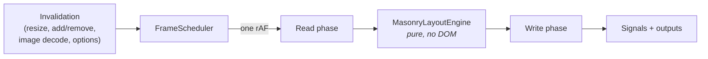

---

## Module graph

Dependencies point downward only. Nothing in `core/` imports the component, and the solver imports
nothing at all.

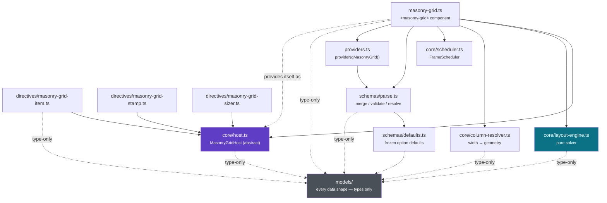

Dotted edges are **type-only**. Everything in `models/` is a declaration — no classes, no
constants — so those imports are erased at compile time and the folder contributes nothing to the
bundle. Runtime values stay next to the behaviour that owns them: the solver in `core/`, the
defaults in `schemas/defaults.ts`, the DI token in `core/host.ts`.

Three edges carry most of the design weight:

**`MasonryGrid` provides itself as `MasonryGridHost`.** The directives inject the abstract class,
never the component:

```ts
providers: [{ provide: MasonryGridHost, useExisting: forwardRef(() => MasonryGrid) }],
```

So `masonry-grid-item.ts` has no import edge back to `masonry-grid.ts`. There is no circular
import, the directives are independently testable against a mock host, and the contract in
[`core/host.ts`](projects/masonry-angular/src/lib/core/host.ts) is a single readable file
describing everything a child needs from its grid.

**The solver has no dependencies.** `MasonryLayoutEngine` takes numbers in and returns numbers out.
It is exported from the public API on its own, so it runs in a worker, a Node test, or another
framework's renderer.

---

## The four collaborators

| Piece                   | File                      | Responsibility                                       | Knows about             |
| ----------------------- | ------------------------- | ---------------------------------------------------- | ----------------------- |
| `MasonryGrid`           | `masonry-grid.ts`         | Owns the DOM, the observers, the pass, and all state | Everything              |
| `FrameScheduler`        | `core/scheduler.ts`       | Collapses N invalidations into 1 callback per frame  | `requestAnimationFrame` |
| `resolveColumnGeometry` | `core/column-resolver.ts` | `(width, options) → { columns, columnWidth }`        | Options only            |
| `MasonryLayoutEngine`   | `core/layout-engine.ts`   | `(measured boxes) → coordinates`                     | Nothing                 |

The component is deliberately the only stateful, DOM-touching, Angular-aware object. The other
three are pure or near-pure and can be reasoned about — and tested — in isolation.

---

## Invalidation: everything funnels into one frame

Eight independent things can invalidate a layout. Every one of them calls the same method.

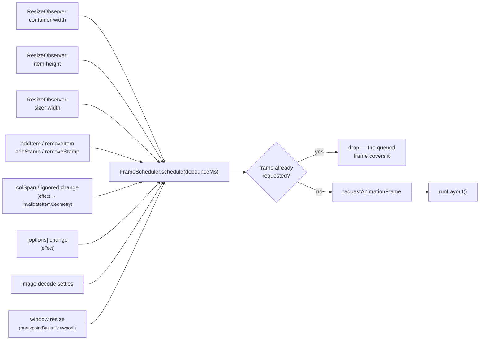

`FrameScheduler` is ~70 lines and does exactly three things:

1. **Coalesce.** `schedule()` is idempotent within a frame — `if (this.frame !== 0) return`. A burst
   of a hundred appended items costs one layout pass, not a hundred.
2. **Debounce, selectively.** `schedule(debounceMs)` restarts a `setTimeout` and only then requests
   the frame. The grid passes `options.resizeDebounce` **only for container resizes**; item
   measurements always pass `0`:

   ```ts
   // onResize()
   this.scheduler.schedule(containerChanged ? this.options().resizeDebounce : 0);
   ```

   A debounced item measurement would make newly added content visibly lag; a debounced container
   resize just avoids re-solving mid-drag.

3. **Stay cancellable.** `cancel()` clears both the frame and the timer, `destroy()` latches so a
   late callback after teardown is a no-op.

### The one observer

There is a single `ResizeObserver` for the container, every item, every stamp, and the sizer — not
one per element. A single observer with many targets is markedly cheaper, and its entries carry
sizes the browser has already computed, so reading them **forces no reflow**:

```ts
function contentWidthOf(entry: ResizeObserverEntry): number {
  const box = entry.contentBoxSize?.[0];
  return box ? box.inlineSize : entry.contentRect.width;
}
```

Box modes are chosen per role:

| Target                            | Box           | Why                                    |
| --------------------------------- | ------------- | -------------------------------------- |
| Width source (host or its parent) | `content-box` | Column math works in content-box space |
| Sizer element                     | `content-box` | Its width _is_ the column width        |
| Items                             | `border-box`  | Stacking needs the outer height        |
| Stamps                            | `border-box`  | Items must flow around the whole box   |

### The `fitWidth` feedback loop, and how it is broken

`fitWidth` shrinks the host to the width the columns actually occupy. Observing the host would then
feed the grid's own write back in as the next pass's input — an oscillation. `syncWidthSource()`
observes the **parent** instead whenever `fitWidth` is on, so the loop cannot form:

```ts
const desired = (options.fitWidth ? this.element.parentElement : this.element) ?? this.element;
```

It is re-evaluated at the top of every pass, so toggling `fitWidth` at runtime re-points the
observer.

---

## Anatomy of a layout pass

`runLayout()` is the heart of the library. The strict ordering below is the reason a pass costs at
most one forced reflow.

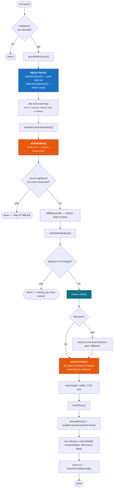

### Read phase

Only two things are read from the DOM, and neither is per-item geometry:

- **`collectOrdered()`** walks `this.element.children` and looks each child up in the `records` map.
  Order therefore comes from the **DOM**, not from registration order — which is why insertions,
  removals and `@for` reorderings keep items in source order without any `reloadItems()` call.
  Ignored items are demoted here; unmeasured or still-decoding items sit the pass out.
- **`collectStampBoxes()`** reads `offsetLeft/Top/Width/Height`, but only when stamps exist. A grid
  without stamps reads nothing at all in this phase.

Item heights and the container width never appear here: they arrived asynchronously through the
`ResizeObserver` and are already in memory.

### Write phase, and why `writeWidths()` comes first

`writeWidths()` runs **before** the "nothing is measured yet" early return. That ordering is
load-bearing: an item cannot report its real height until it has been given its column width, so
this write is what unblocks the measurement the _next_ pass consumes.

Each write is guarded against redundancy:

```ts
if (record.lastWidth !== width) {
  record.lastWidth = width;
  style.width = `${width}px`;
}
```

...and the whole walk is skipped when the geometry is unchanged and nothing was added, removed or
respanned:

```ts
const geometryUnchanged =
  columns === this.widthsColumns &&
  columnWidth === this.widthsColumnWidth &&
  options.gutterX === this.widthsGutterX;
if (geometryUnchanged && !this.widthsDirty && !options.contentVisibility) return;
```

`contentVisibility` is the deliberate exception: `contain-intrinsic-size` encodes the _measured
height_, which changes far more often than the width does. A stale value makes the browser
mis-report the size of everything it skipped, and the scrollbar jumps as those items scroll in.

Positions are written as 2D `transform`, not `top`/`left`:

```ts
record.handle.element.style.transform = `translate(${x.toFixed(2)}px, ${y.toFixed(2)}px)`;
```

`translate` rather than `translate3d` is intentional — a very long grid would otherwise promote
every item to its own compositor layer.

---

## Bootstrap: why the first layout takes two passes

Nothing has a height until it has a width. The grid therefore reaches a stable layout through two
passes joined by an asynchronous observer callback.

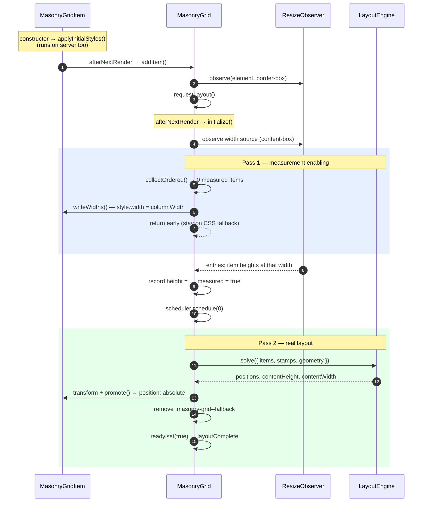

The early return in pass 1 — `if (records.size > 0 && ordered.length === 0) return` — is what
prevents a visible flash of an empty grid: the multi-column fallback keeps painting until there is
something real to show.

---

## Column geometry resolution

`resolveColumnGeometry()` is a pure function of `(availableWidth, basisWidth, options, sizerWidth)`.
There are two branches, and precedence between them is the part worth knowing.

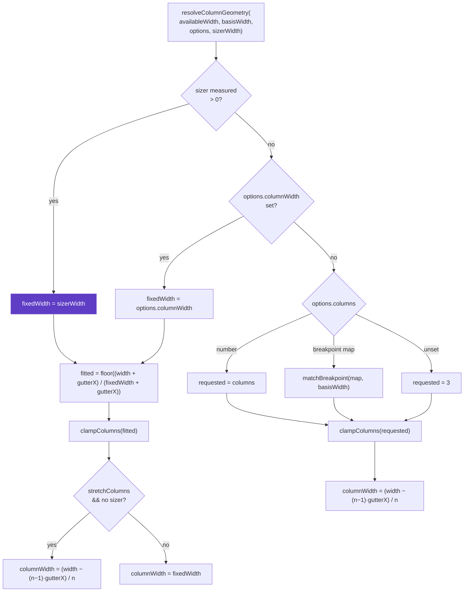

Three details:

- **A sizer wins over everything.** It states the column width explicitly, so `stretchColumns` is
  suppressed in that branch (`sizerWidth === undefined` in the condition) — stretching would
  contradict what the stylesheet said. A development-mode warning fires if `columns` or
  `columnWidth` is set alongside a sizer.
- **`clampColumns`** applies `minColumns` and `maxColumns` with a hard floor of 1:
  `Math.max(1, Math.min(Math.max(count, minColumns), maxColumns ?? ∞))`.
- **Breakpoint keys are sorted once per object**, cached in a `WeakMap` keyed by the map's identity,
  so a `{ 0: 1, 768: 2 }` literal costs one `Object.keys().sort()` for its lifetime rather than one
  per pass. `matchBreakpoint` then selects the largest key at or below the basis width, where the
  basis is the container or the viewport per `breakpointBasis`.

---

## The solver

[`MasonryLayoutEngine.solve()`](projects/masonry-angular/src/lib/core/layout-engine.ts) maintains
one number per column — the next free Y offset — and walks the items once.


### Column choice

```ts
// Index of the column group of `span` columns with the lowest top offset.
for (let c = 0, last = columns - span; c <= last; c++) {
  const y = this.spanTop(colYs, c, span);
  if (y < bestY - EPSILON) {
    bestY = y;
    bestColumn = c;
  } // strict improvement only
}
```

The `EPSILON` (0.001) comparison with _strict_ improvement is what makes ties resolve
left-to-right deterministically — without it, floating-point noise in measured heights would let
equal columns swap between passes and items would visibly jitter.

### Gutters are baked into the column height

```ts
const next = bottom + gutterY;
for (let c = column, end = column + span; c < end; c++) colYs[c] = next;
if (bottom > contentHeight) contentHeight = bottom;
```

Storing the _next free offset_ rather than the bottom edge means the gutter never trails at the
bottom of the grid: `contentHeight` tracks the true bottom, while `colYs` already includes the gap
the next item needs.

### `verticalOrigin: 'bottom'` is a reflection, not a second algorithm

The solve is unchanged; the finished coordinates are mirrored about `contentHeight`. Reflecting a
packing is _exact_ rather than approximate — it produces precisely the packing you would get by
filling from the other edge. The known limitation is stamps: they are resolved against the top edge
and then mirrored with everything else, so items flow around the wrong region. A development-mode
warning says so rather than silently misplacing content.

### RTL

RTL is also pure arithmetic, applied at write time inside the solver:

```ts
const rightEdge = Math.max(containerWidth, columns * stride - gutterX);
positions[i * 2] = rtl ? rightEdge - width - column * stride : column * stride;
```

### Buffers

`positions`, `widths` and `columnHeights` are `Float64Array`s that grow geometrically
(`max(needed, length * 2)`) and are **reused between passes**. The returned solution aliases them —
they are read immediately in the write phase and never retained, which is what makes a steady-state
relayout of an unchanged grid allocate nothing.

---

## The signature: skipping work that would change nothing

`computeSignature()` folds every input to `solve()` into one 32-bit integer using the classic
`hash * 31 + x` accumulation, with floats rounded to 1/100 px (`HASH_PRECISION = 100`).

```ts
if (signature === this.signature) return; // identical inputs ⇒ identical output
this.signature = signature;
```

What goes in: column count, column width, **container width**, sizer width, both gutters,
`horizontalOrder`, `direction`, `verticalOrigin`, item count, every item's height and span, and
every stamp's box.

The container width looks redundant next to the geometry, and is not: in an RTL pass items anchor
to the right edge, so with a fixed `columnWidth` the container can resize — moving every item —
while the column count and column width stay exactly the same.

Two conventions:

- `0` is reserved as a **force sentinel**. `layout()` and the options `effect` set
  `this.signature = 0`, and the hash never returns 0 (`return hash === 0 ? 1 : hash`), so a forced
  pass can never be mistaken for an unchanged one.
- The check sits _after_ `writeWidths()`, so a skipped pass still keeps item widths correct.

This is what makes a resize drag cheap: the observer fires on every frame, but only the frames where
the geometry actually crosses a threshold do any solving or DOM writing.

---

## Item lifecycle

An item is a `MasonryGridItem` directive plus an `ItemRecord` the grid owns. The record carries the
last values written to the DOM, so an unchanged pass writes nothing.

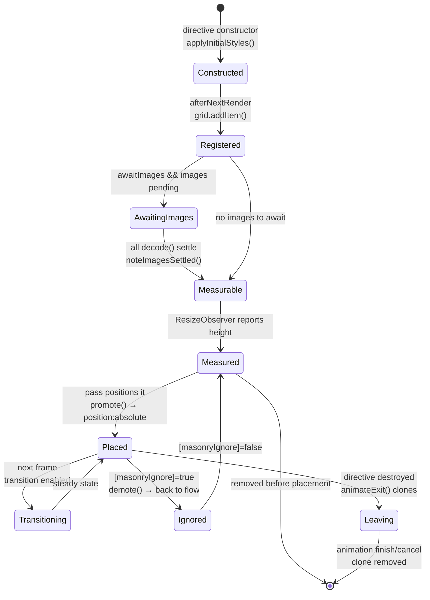

Three subtleties:

**`applyInitialStyles()` runs in the constructor, not `afterNextRender`** — so it executes on the
server too. With `ssr.fallback: 'columns'` it sets `break-inside: avoid; width: 100%`, which is what
makes the server response a usable multi-column page; with `'none'` it sets `visibility: hidden`
rather than flashing an unstyled stack.

**Images are awaited with `decode()`, never `load`.** `decode()` resolves only once the frame is
ready to paint, so the height measured is the height that will render. Lazy images are deliberately
_never_ awaited — one still off-screen would never resolve and would strand the item forever:

```ts
if (image.complete || image.loading === 'lazy' || !image.currentSrc) continue;
pending.push(image.decode().catch(() => settled(image)));
```

The pending count is also released in `onDestroy`, because an item torn down mid-decode would
otherwise hold `itemsLoaded` back permanently.

**Ignoring is reversible.** `demote()` is the exact inverse of `promote()`: it clears position,
margin, width, transform, transition and the `contain-intrinsic-size` bookkeeping, and resets
`lastWidth`/`lastX`/`lastY` to sentinels so the next placement writes everything fresh.

---

## Motion model

Three independent mechanisms, each with a different job:

| Mechanism    | Applies to           | Implementation                      | Why this one                                    |
| ------------ | -------------------- | ----------------------------------- | ----------------------------------------------- |
| **Entry**    | Newly placed items   | Web Animations, `fill: 'backwards'` | Staggered per batch, capped by `maxStagger`     |
| **Movement** | Already-placed items | CSS `transition: transform`         | Compositor-only; browser owns the interpolation |
| **Exit**     | Removed items        | Web Animations on a **clone**       | The real element is already detached            |

### Why exits animate a clone

Angular detaches an element as soon as its directive is destroyed, so by the time `removeItem()`
runs there is nothing left on screen to animate. The grid clones the node — the clone inherits the
inline position, width and transform the grid wrote, which is exactly what makes it land where the
item was — appends it to the host, animates that, and discards it on `finish` or `cancel`:

```ts
const clone = source.cloneNode(true) as HTMLElement;
clone.classList.add('masonry-item--leaving');
clone.setAttribute('aria-hidden', 'true');
clone.style.pointerEvents = 'none'; // scenery: no pointer input
clone.style.transition = ''; // must not inherit the position transition
```

Consequences worth knowing: the clone is inert (no component state, no event handlers), it is hidden
from assistive technology, and it is removed on teardown before any `finish` event can fire — which
is why `destroyed` is latched _first_ in the `onDestroy` handler, so a cancelled animation cannot
emit on the way out.

### Why the transition is enabled one frame late

An item placed with `transition: transform` already active would slide in from the origin. So
`promote()` positions it, and only on the **next** frame does `enableTransitionsNextFrame()` set the
transition property:

```ts
this.transitionFrame = requestAnimationFrame(() => {
  const value = `transform ${duration}ms ${easing}`;
  for (const record of this.transitionQueue) {
    if (record.transitioned) continue;
    record.transitioned = true;
    record.handle.element.style.transition = value;
  }
  this.transitionQueue.length = 0;
});
```

Only `transform` is transitioned. Transitioning `width` would relayout every item on every frame of
a resize.

### `removeComplete` accounting

Removals reach the same counter by two routes, and the event fires once per batch:

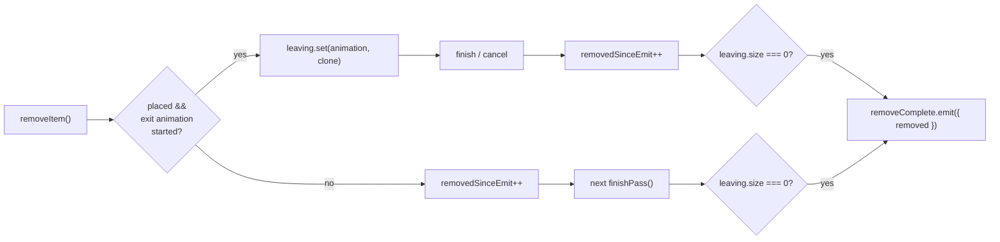

Un-animated removals are reported from `finishPass()` rather than immediately — the event then means
"the gap has actually closed", not merely "the directive was destroyed".

---

## Options pipeline

Options flow through four stages, and each exists for a distinct reason.

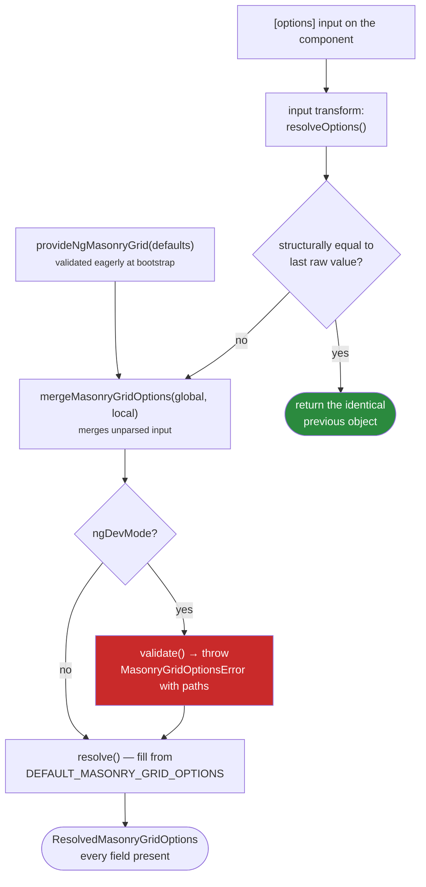

**Identity caching is what makes inline literals free.** `[options]="{ gutter: 16 }"` allocates a
fresh object on every change detection run. `resolveOptions()` compares it structurally against the
last raw value and, on a match, returns the _identical_ previous resolved object — so the input
signal sees no change, no downstream `computed` recomputes, and no layout is queued.

**Merging happens before validation, on unparsed input.** That is what lets a component override a
single field of a nested group without restating its siblings — `{ ssr: { columns: 3 } }` keeps the
provided `fallback`. `mergeMasonryGridOptions` also clears the counterpart when one of the mutually
exclusive `columns` / `columnWidth` pair is set, so a local override does not trip the exclusivity
check against a global default.

**Validation is development-only, by construction.** Every check is inside
`if (typeof ngDevMode === 'undefined' || ngDevMode)`. Production builds replace `ngDevMode` with
`false`, so the validator and everything reachable only from it is dropped by the bundler. This is
the reason the library hand-writes types and defaults instead of deriving both from a schema
library: a schema runtime would ship to every user, and the only thing it would do in production is
catch mistakes the application developer already made in TypeScript.

`DEFAULT_MASONRY_GRID_OPTIONS` (in `schemas/defaults.ts`) is a deeply `Object.freeze`d single
source of truth, tagged `satisfies ResolvedMasonryGridOptions` — the type it fills in lives in
`models/options.ts` — and a test asserts the two stay in step.

---

## Change detection and zones

The grid is `ChangeDetectionStrategy.OnPush` and works identically zoneful or zoneless.

- **All plumbing runs outside Angular.** Observer construction, subscription and the `resize`
  listener are wrapped in `zone.runOutsideAngular()`. A `ResizeObserver` callback firing on every
  frame of a drag never schedules change detection.
- **Signals are the notification channel.** `finishPass()` sets `columns`, `columnWidth`,
  `contentHeight`, `itemCount` and `ready`. Writing a signal is what makes a zoneless application
  re-render, and the host bindings (`--masonry-gutter-x`, `.masonry-grid--ready`, …) read from
  signals and `computed`s.
- **`zone.run()` wraps only output emissions** — `layoutComplete`, `removeComplete`, `itemsLoaded`.
  It is a no-op under zoneless change detection and the correct bridge back into Angular for
  zone-based applications, so a consumer's handler runs in the zone it expects.

The one imperative DOM write that bypasses signals is removing `masonry-grid--fallback` on the first
pass. A host-binding update lands on the next change detection — a frame in which items are already
transformed but still in normal flow, which reads as a visible jump. The class is therefore removed
inside the same synchronous write phase, and the `usesFallback()` computed agrees a moment later.

---

## Server-side rendering and the fallback handoff

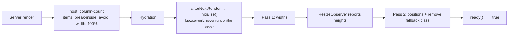

`afterNextRender` is browser-only, which doubles as the SSR guard: the server renders the CSS
multi-column approximation and never constructs an observer. Multi-column is not true masonry — it
fills top to bottom per column — but it uses the right gaps and column count, so the server response
is useful without JavaScript and hydration swaps in the real layout without a shift.

`ssr.fallback: 'none'` opts out; items then stay `visibility: hidden` until the first client pass.
When using the `'columns'` fallback, set `entryAnimation.animateInitial: false` — the items are
already painted, so animating them in is a regression, not a flourish.

---

## Performance invariants

These are the properties the implementation is built to preserve. Breaking one is a regression even
if every test still passes.

| Invariant                                       | Enforced by                                                                  |
| ----------------------------------------------- | ---------------------------------------------------------------------------- |
| At most one layout pass per animation frame     | `FrameScheduler` idempotent `schedule()`                                     |
| Reads never interleave with writes              | Phase ordering in `runLayout()`                                              |
| No forced reflow when there are no stamps       | Sizes come from `ResizeObserverEntry`, not `getBoundingClientRect()`         |
| A no-op pass allocates nothing                  | Reused `Float64Array`s, reused `MeasuredSlot` objects, reused scratch arrays |
| A no-op pass writes nothing                     | Signature check + per-property `last*` guards                                |
| A resize drag does not re-solve every frame     | Signature check + `resizeDebounce`                                           |
| One observer, not one per item                  | Single `ResizeObserver` with many targets                                    |
| Repositioning stays off the layout/paint path   | 2D `transform`, `transition: transform` only                                 |
| Long grids do not promote every item to a layer | `translate`, not `translate3d`                                               |
| Breakpoint keys are sorted once per map         | `WeakMap` cache keyed by object identity                                     |
| Validation costs production zero bytes          | `ngDevMode` guards                                                           |

The scratch buffers reused across passes — `ordered`, `measured`, `stampBoxes`, `entering` — are
truncated with `.length = 0` rather than reallocated, and `fillMeasured()` mutates the existing slot
objects in place:

```ts
const slot = (this.measured[i] ??= { height: 0, colSpan: 1 });
slot.height = record.height;
slot.colSpan = record.handle.colSpan();
```

---

## Testing model

jsdom implements neither `ResizeObserver`, nor real layout, nor the Web Animations API. The
`masonry-angular/testing` entry point supplies deterministic doubles for all three, which is what
makes the multi-pass behaviour assertable.

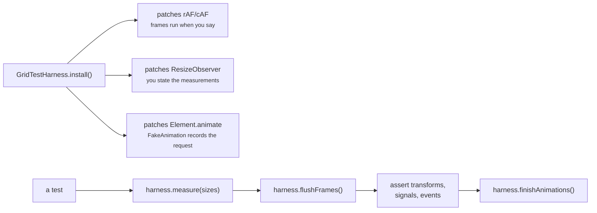

`flushFrames()` drains repeatedly (up to `maxRounds`) because a pass can schedule another frame —
the deferred transition-enabling frame, for instance. `measure()` reports sizes to every observer
watching the given elements, which is how a test drives the exact two-pass sequence the browser
would produce.

The pure modules are tested directly and need none of this: `layout-engine.spec.ts` and
`column-resolver.spec.ts` are plain function tests, and `options.spec.ts` covers merge, validation
and structural equality.

---

## Extension points

The public API deliberately exposes more than the component, so the pieces are reusable
independently:

| Export                                                                      | Use                                                                |
| --------------------------------------------------------------------------- | ------------------------------------------------------------------ |
| `MasonryLayoutEngine`                                                       | Solve a layout in a worker, on the server, or in another framework |
| `resolveColumnGeometry`, `resolveFallbackColumns`                           | Reuse the responsive column math anywhere                          |
| `FrameScheduler`                                                            | Coalesce your own invalidations onto a frame                       |
| `MasonryGridHost`, `MasonryItemHandle`                                      | Implement a custom host, or mock the grid in tests                 |
| `parseMasonryGridOptions`, `mergeMasonryGridOptions`, `masonryOptionsEqual` | Validate or compose options ahead of time                          |
| `NG_MASONRY_GRID`                                                           | Import every directive in one line                                 |

Because `MasonryGridHost` is an abstract class rather than an interface, it is both the DI token and
the contract — a custom implementation can be provided under it and the stock item, stamp and sizer
directives will drive it unmodified.

---

## Design decisions and their trade-offs

| Decision                                                | Bought                                                                 | Cost                                                                              |
| ------------------------------------------------------- | ---------------------------------------------------------------------- | --------------------------------------------------------------------------------- |
| Pure solver, isolated from Angular and the DOM          | Trivial unit tests, worker/SSR reuse, enforced read/write split        | Component must marshal state in and coordinates out                               |
| Order derived from the DOM child list, not registration | Insertions, removals and `@for` reorders just work; no `reloadItems()` | One child-list walk per pass                                                      |
| Single shared `ResizeObserver`                          | Far cheaper than one per item; reflow-free sizes                       | Callback must demultiplex targets by identity                                     |
| Integer signature over the inputs                       | Whole passes skipped for free                                          | Every new solver input must be folded in, or staleness results                    |
| Hand-written validation behind `ngDevMode`              | Precise dev errors; zero production bytes                              | Types, defaults and validators must be kept in step manually (a test guards this) |
| Exit effects animate a clone                            | Exits are possible at all under Angular's teardown order               | Clone is inert; the effect cannot react to component state                        |
| `verticalOrigin: 'bottom'` implemented as a reflection  | Exact, and one code path instead of two                                | Stamps are unsupported in that mode (dev warning)                                 |
| `transform` for position, CSS transition for movement   | Compositor-only movement; no layout thrash                             | Consumer keyframes must use `translate`/`scale`/`rotate`, never `transform`       |
| Structural identity caching on `[options]`              | Inline object literals cost nothing                                    | A deep compare on each change detection run when the value differs                |
